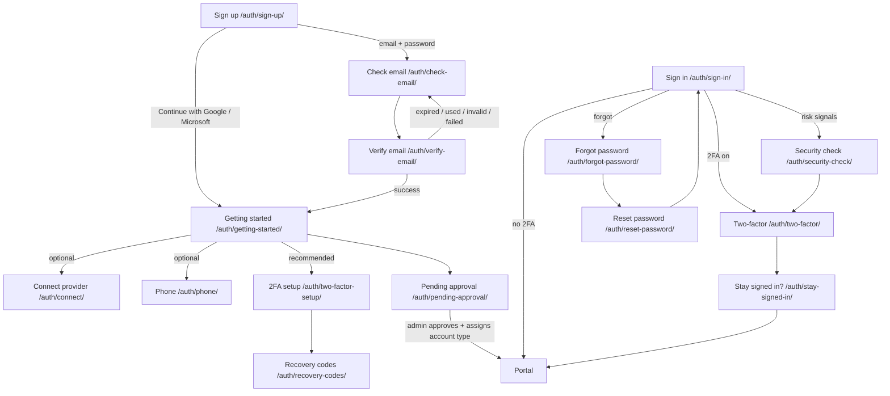
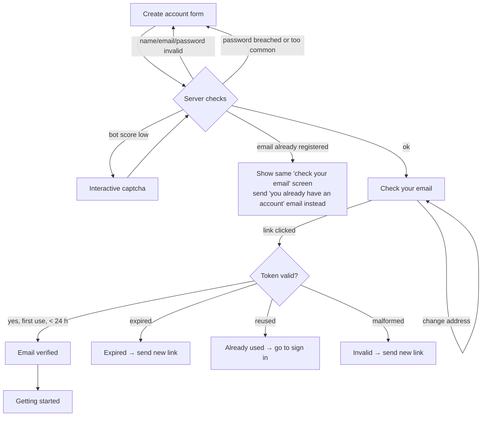
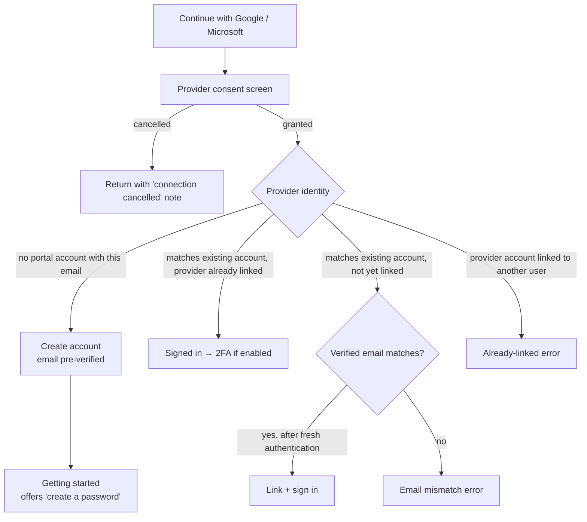
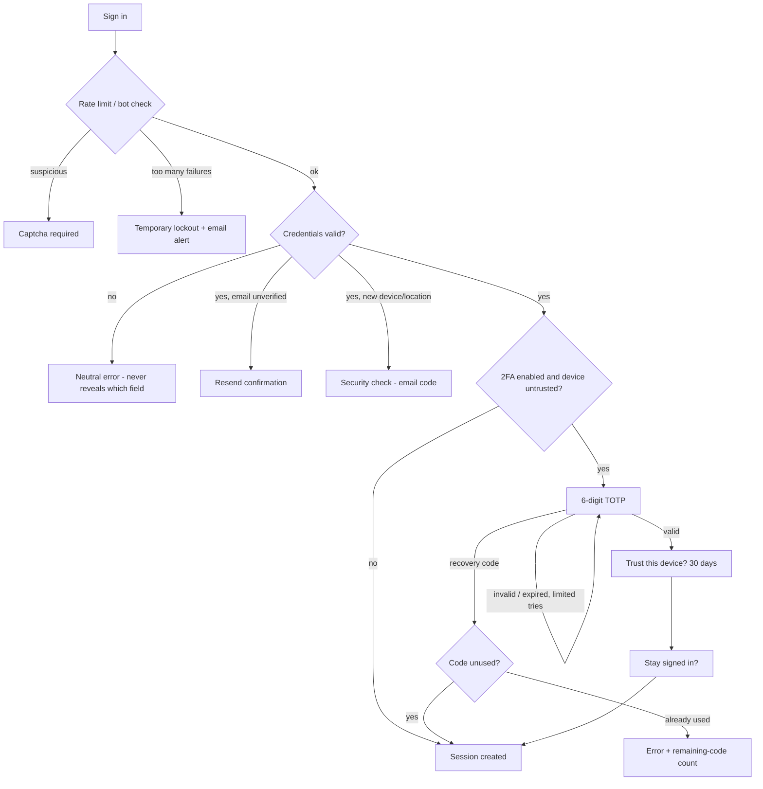
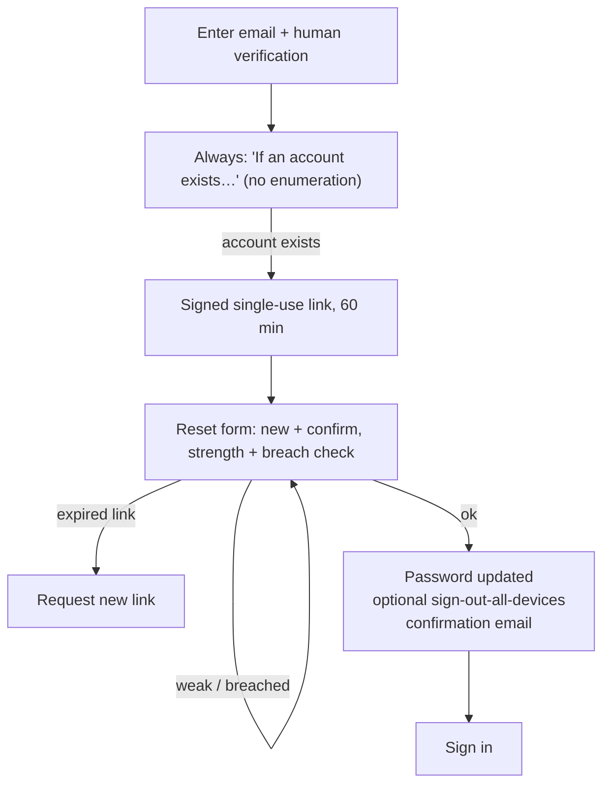
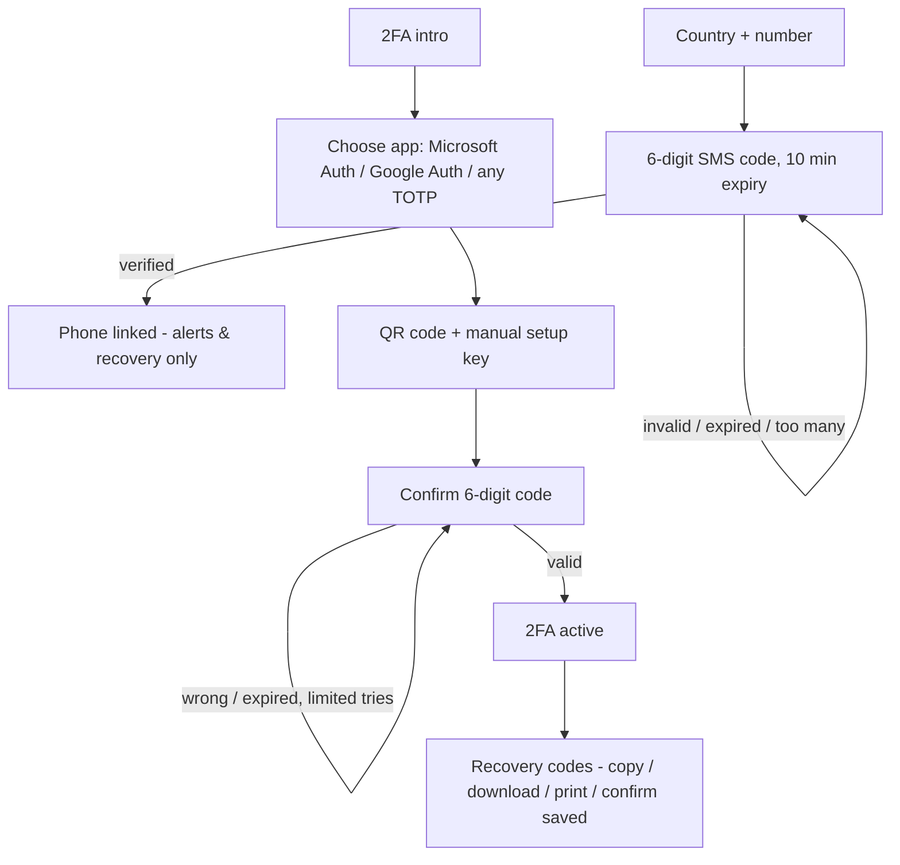

# Authentication & Onboarding - Design Specification

**Status:** design phase - no authentication code exists yet.
**Prototype:** every screen below is built as a static page under [`public/auth/`](public/auth/) (plus [`public/security-settings/`](public/security-settings/)). Open [`/auth/`](public/auth/index.html) for a clickable map of all screens and states. Forms are `action="#"` - nothing is submitted anywhere.
**Design system:** everything reuses `tokens.css → theme.css → auth.css`, with one additive stylesheet (`public/css/auth-flow.css`) and one prototype script (`public/js/auth-flow.js`). The original auth pages (`/sign-in/`, `/sign-up/`, `/forgot-password/`, `/setup-new-password/`, `/two-step-verification/`, `/choose-account-type/`, `/account-info/`) were intentionally left untouched; the new flow lives alongside them.

**Decisions this design encodes**

| Decision | Choice |
|---|---|
| Sign-in providers | Email + password, **Continue with Google**, **Continue with Microsoft**. Apple removed everywhere. |
| Microsoft naming | "Continue with Microsoft" = OAuth sign-in with a Microsoft account. **Microsoft Authenticator / Google Authenticator** = TOTP apps offered during two-factor setup. One standard TOTP implementation serves both (and any compatible app). |
| Account type | Chosen **by an administrator** after reviewing the account - users never pick Personal/Corporate. New accounts land on **Pending approval** after onboarding. |
| Two-factor policy | **Optional but strongly encouraged.** Only email verification is mandatory. Every security step has a visible skip path and can be finished later in Security settings. |
| Tone | Short, calm, no fear-based wording, no technical detail that helps an attacker, required vs optional clearly labelled. |

---

## 1 · Screen list

| # | Screen | Path | States |
|---|--------|------|--------|
| 0 | Design preview map | `/auth/` | - |
| 1 | Create account | `/auth/sign-up/` | default · loading · errors · breached · captcha · locked |
| 2 | Check your email | `/auth/check-email/` | sent · countdown · resent · change · wrong-email · too-many |
| 3 | Email verification result | `/auth/verify-email/` | verifying · success · expired · used · invalid · failed · sent-new |
| 4 | Getting started (security checklist) | `/auth/getting-started/` | fresh · partial · complete · reminder |
| 5 | Connect sign-in method | `/auth/connect/` | default · connecting · connected · already-linked · mismatch · cancelled · failed · create-password · password-created (+ disconnect dialog) |
| 6 | Add & verify phone | `/auth/phone/` | enter · sending · code · invalid · expired · too-many · success |
| 7 | Two-factor setup wizard | `/auth/two-factor-setup/` | intro · app · scan · qr-expired · confirm · wrong · expired-code · locked · done · already · cancel |
| 8 | Recovery codes | `/auth/recovery-codes/` | fresh · copied · saved · regenerate |
| 9 | Sign in | `/auth/sign-in/` | default · loading · error · captcha · locked · unverified |
| 10 | Two-factor challenge | `/auth/two-factor/` | default · invalid · expired · too-many · locked · recovery · recovery-ok · recovery-used |
| 11 | Stay signed in? | `/auth/stay-signed-in/` | default |
| 12 | Forgot password | `/auth/forgot-password/` | form · loading · sent · too-many |
| 13 | Reset password | `/auth/reset-password/` | form · weak · expired · invalid · success |
| 14 | Security check (suspicious login) | `/auth/security-check/` | new-device · new-location · unusual · attempts · captcha · locked · confirm-email |
| 15 | Pending approval | `/auth/pending-approval/` | pending · approved · info-needed |
| 16 | Security settings (in-app) | `/security-settings/` | populated · empty (+ 6 confirm dialogs) |

Every page supports desktop / tablet / mobile (existing `tma-auth` breakpoints at 960 / 760 / 720 / 560 px), light and dark mode (`data-theme="dark"`, shared `tma.themeMode` / `tma.theme` localStorage keys with the dashboard), keyboard navigation, and `?state=<name>` deep links for review.

---

## 2 · Screen order (first-time user, email + password)

1. `/auth/sign-up/` - create account
2. `/auth/check-email/` - confirmation email sent
3. `/auth/verify-email/` - user opens the emailed link → **success**
4. `/auth/getting-started/` - security checklist (connect provider / phone / 2FA / recovery codes, all optional)
5. `/auth/pending-approval/` - admin reviews, approves, and assigns account type
6. Portal dashboard

A user who registers with Google or Microsoft skips steps 2–3 (the provider's verified email is trusted) and enters the checklist directly, where **Create a password** replaces **Connect a sign-in method** (`/auth/connect/?state=create-password`).

Returning users: `/auth/sign-in/` → (if 2FA on and device not trusted) `/auth/two-factor/` → (first time on a new trusted device) `/auth/stay-signed-in/` → portal. The stay-signed-in question is stored per device and not asked again.

---

## 3 · User-flow diagrams

### Master map



### Email + password registration



### Google / Microsoft registration & login (identical shape; only the provider differs)



### Login + two-factor



### Forgot / reset password



### Phone verification & authenticator setup



---

## 4 · Copy & UX rules applied on every screen

- **Neutral errors.** Never "wrong password" vs "no such account"; never confirm an email exists (sign-up duplicate emails are handled by *emailing the owner*, not an on-screen reveal; forgot-password always says *"If an account exists for this email address, password reset instructions have been sent."*).
- **Required vs optional labelled** with quiet pill badges: `Done / Optional / Recommended`.
- **No fear language.** Lockouts and checks say what happened, how long it lasts, and the one thing the user can do next.
- **Spam-folder hints** on every "we sent you an email" screen; resend buttons always throttled with a visible countdown.
- **Masked identifiers** where the viewer didn't just type them (`+1 ••• ••• ••89`).
- **Password managers are first-class:** paste allowed, correct `autocomplete` attributes (`email`, `name`, `new-password`, `current-password`, `one-time-code`), no max-length traps.
- **Loading / success / warning / disabled / empty / error** states exist for every interactive surface (see state list in §1; walk them via the `?state=` switcher).

---

## 5 · Bot & abuse prevention plan

No single layer makes the platform hacker-proof; the design assumes each layer fails sometimes and stacks them.

| Layer | Design | Notes |
|---|---|---|
| Human verification | **Cloudflare Turnstile** (recommended; invisible-first). Slot on sign-up, sign-in (challenged state), forgot-password. reCAPTCHA v3/hCaptcha are drop-in alternates. | The prototype shows a quiet placeholder widget; escalate to interactive only on low trust score. |
| Email verification | Mandatory before the checklist. Signed, single-use tokens, 24 h expiry, newest-link-wins. | Screens 2–3. |
| Rate limiting | Per-IP and per-account sliding windows on sign-up, sign-in, resend, reset, OTP verify. | Redis-backed (Laravel `RateLimiter`). |
| Login attempt limits | Progressive delays → 15-min temporary lockout; lockout notice never confirms the account exists. | Screen 9 `locked`, screen 14 `attempts`. |
| Temporary lockouts | Time-boxed, self-healing, always paired with an email alert and a password-reset path. | Never permanent from automation alone. |
| Password reset limits | Max requests per address/IP per window; `too-many` state; resend countdowns (60 s). | Screen 12. |
| Resend-code limits | Countdown + hourly cap for email and SMS codes; SMS additionally capped per day (toll-fraud protection). | Screens 2, 6, 14. |
| Suspicious device detection | Device fingerprint (UA + heuristics) + IP geolocation; unseen device/location triggers an email code before the session is issued. | Screen 14 `new-device` / `new-location`. |
| New-device verification | 6-digit email code, 10 min expiry; success registers the device. | Screen 14. |
| Session management | HttpOnly + Secure + SameSite=Lax cookies, ID rotation on login/privilege change, absolute + idle timeouts, server-side session store so "sign out all devices" works instantly. | Screen 16 sessions section. |
| Credential stuffing | Breached-password blocking (HIBP k-anonymity) at sign-up/reset, per-account velocity alerts, captcha escalation on distributed failures, optional 2FA. | |
| Brute force | Lockouts + progressive delays + TOTP attempt caps (wizard and login lock independently). | Screens 7/10 `locked`. |
| Logging | Append-only auth event log: sign-ins, failures, lockouts, password/2FA/recovery changes, admin approvals - feeds the "Recent login activity" table. | Screen 16. |
| Security alerts by email | New device sign-in (always on), password changed, 2FA changed, recovery codes regenerated, account locked. | Screen 16 notification prefs. |
| Expiring links | Email confirmation 24 h · password reset 60 min · email OTP 10 min · SMS OTP 10 min · TOTP 30 s window (±1 step). | Stated in copy on each screen. |
| Admin approval | New accounts can't reach client data until an administrator approves and assigns the account type - a human backstop against fake registrations. | Screen 15. |

## 6 · Password policy (NIST-aligned)

- Minimum **10 characters**; maximum at least **64**; all printable characters + spaces allowed (passphrases encouraged).
- **Block common & breached passwords** (Have I Been Pwned range API + local top-10k list). The breach message explains *why* without blaming the user.
- **No forced composition** (symbols are scored, not required) and **no periodic expiry** - rotation only on evidence of compromise.
- Live **strength meter** (existing 4-segment component) + requirement checklist; server is the source of truth, meter is guidance.
- Paste and password managers explicitly supported; show/hide toggles on every password field.
- Reset flow: single-use signed token, 60 min expiry, session rotation, optional (default-on) sign-out-all-other-devices, confirmation email on change.

---

## 7 · Backend services & APIs required (future work)

| Concern | Recommendation |
|---|---|
| Auth scaffolding | **Laravel Fortify** (login, registration, email verification, reset, TOTP 2FA, rate limiting hooks) - the repo is already Laravel 13. |
| OAuth | **Laravel Socialite**: Google (OIDC) + Microsoft (Entra ID `common` endpoint) drivers; account-linking table `connected_accounts (user_id, provider, provider_id, email, verified)`. |
| TOTP | Fortify's built-in (pragmarx/google2fa) - one implementation covers Microsoft Authenticator, Google Authenticator, and every RFC 6238 app. Encrypted secret column; recovery codes stored **hashed**, one-time. |
| Email | Transactional provider (Postmark / SES / Resend) with templates: confirm email, reset password, security alert, new-device code, account approved / info needed. |
| SMS | Twilio or Vonage Verify for phone codes; daily caps + country allowlist. |
| Human verification | Cloudflare Turnstile server-side `siteverify` on sign-up / challenged sign-in / reset. |
| Breach check | HIBP `range` API (k-anonymity - only a hash prefix leaves the server) with local fallback list. |
| Rate limiting | Laravel `RateLimiter` on Redis; named limiters per surface (login, signup, otp, resend, reset). |
| Sessions & devices | DB/Redis session driver; `trusted_devices` and `auth_events` tables; GeoIP lookup for display. |
| Admin approval | `users.status` (pending / approved / info_needed) + admin queue UI (out of scope here) + "account approved" email; middleware gate on portal routes. |
| Token infra | Signed single-use tokens for email links (hashed at rest, expiry column, invalidate-previous-on-resend). |

## 8 · Security considerations & risks

- **Account enumeration** - every public surface (sign-up, sign-in, forgot) responds identically whether or not the account exists; timing should be padded on the email-sending path.
- **OAuth linking hijack** - only auto-link a provider when the provider email is verified *and* matches; otherwise require a fresh password authentication before linking. Validate `state`/`nonce`; exact-match redirect URIs (open-redirect protection).
- **TOTP secrets** - encrypted at rest, never re-displayed after setup; re-setup generates a new secret and invalidates the old.
- **Recovery codes** - hashed like passwords, shown exactly once, count surfaced in settings, regeneration invalidates the old set and sends an alert email.
- **SMS/SIM-swap** - phone is for alerts + recovery assistance only, never the sole second factor; authenticator app is the primary 2FA.
- **Session fixation/theft** - rotate session ID at every privilege boundary; trusted-device tokens are httpOnly, per-device, revocable from settings.
- **Phishing of links** - emails state what was requested and from where; links are single-use; "newest link wins" limits replay of old emails.
- **Trusted-device token theft** - 30-day cap, revocation list in settings, new-device alerts always on.
- **Admin-approval social engineering** - approval UI (future) should show verified email, sign-up metadata, and risk signals to the admin before approval.
- **Residual risks** - malware on the user's device, provider account takeover (Google/Microsoft side), and support-channel social engineering are out of the product's direct control; logging + alerts exist to shorten detection time.

## 9 · Recommended development order

1. **Core email auth** - Fortify: registration, login, email verification, password reset; password policy + HIBP; neutral error copy. *(Screens 1–3, 9, 12–13)*
2. **Abuse hardening** - rate limiters, progressive lockouts, Turnstile, security-alert emails, auth event log. *(States: captcha/locked/too-many; screen 14)*
3. **OAuth** - Google + Microsoft sign-in/sign-up via Socialite; account linking + create-password path. *(Screens 5, provider buttons on 1/9)*
4. **TOTP 2FA** - setup wizard, QR/manual key, 2FA login challenge, recovery codes (hashed, regenerate). *(Screens 7, 8, 10)*
5. **Phone verification** - SMS codes for alerts/recovery. *(Screen 6)*
6. **Sessions & devices** - trusted devices, active sessions, login history, sign-out-all, notification prefs; wire Security settings. *(Screens 11, 16)*
7. **Risk engine & approval** - new-device/location checks, admin approval queue + account-type assignment, pending/approved emails. *(Screens 14, 15)*

Each phase ships independently; the prototype pages become the templates for each phase.

## 10 · Reviewing the prototype

```bash
cd public && python3 -m http.server 8000     # http://localhost:8000/auth/
```

- **All screens:** `/auth/` (also linked from the floating panel on every page).
- **States:** the "Preview state" control (bottom right) or `?state=<name>` in the URL.
- **Dark mode:** sun/moon toggle top right - shares the portal's `tma.themeMode` preference.
- **Flow walk-through:** submitting any form advances to the next screen like the real flow would; the floating panel's "Next screen" link does the same.
- The GitHub Pages build (`scripts/prepare-github-pages.py`, run by CI) publishes these pages with rewritten asset paths automatically.
